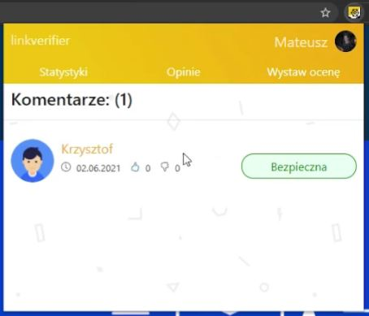

## Link Verifier - Chrome extension

Extension increases user security and simplifies usage of Link Verifier Web App.
**Note:** Extension is available only in the Polish version

### Technologies
- JavaScript
- Chromium API

Extension use Manifest V3

### Functionalities
- Popup info at website content about safety level of the site you are currently browsing. Extension blocks interaction with website which is marked in database as *very dangerous*. The page below was selected randomly, for demonstration purposes only.

After clicking extension icon user can access to three tabs:

- At the first tab is shown safety information about the site you are currently browsing. The information is included in heading and animated pie chart. On the right there is more details in percentage about given opinions. There are seven types of opinions:
    - Neutral
    - Safe
    - Reliable
    - Fraud
    - Indicent content
    - Fake news
    - Virus
- User can also login to the app
- Logged in user can enter his profile by clicking profile icon

- At the second tab user can navigate through the all opinions, which are sorted by likes. Most liked opinions are at the top
- Clicking nickname or profile picture of the author of opinion takes the user to the authors profile page
- User can leave like to the opinion he agree with or dislike to the opinion he disagree
**Note:** only logged in users can leave like or dislike at the opinion.

- There are selected three groups of opinions:
    - green opinions are positive
    - blue opinions are neutral
    - red opinions are negative

- At the last tab user can leave fast opinion for the site he is currently browsing. After clicking one selected opinion, it will be posted automatically. To leave full opinion user can click just link below. 
**Note:** only logged in users can access to this tab. If user left opinion before, it will be shown there.

### Installation
**Note:** Extension only works on chromium based browsers.
Download full directory, and unpack zip file. Open web browser, get into extensions settings, turn on developer mode and add unpacked directory. Extension will be installed automatically.
**Note:** To work properly extension needs backend server of the app and frontend server.
